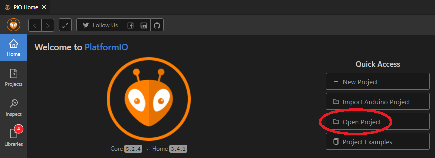

# ESP32-firmware

## Description

As we are trying to create our Pick-By-Light system, we need some way to control the LEDs in our shelfs.  
For this, we are using microcontrollers running dedicated firmware.  
_The software run by these microcontrollers is to be found in this part of the project._  
They are responsible for reacting to messages using the [MQTT-Protocol](https://mqtt.org/) and fulfill send assignements.
These include:
* Controlling any connected LEDs
* Functionality to be registered as a new shelf in the complete system
* Using the microcontollers memory to save its own shelf-configuration, and
* have the ability to load a backup back into the main database in case of a critical failure  
  
For achieving these abilities, the firmware takes care of basic functionality, like:
* Connecting to a WLAN
* Setting up a MQTT Client, and
* listen to any incoming messages

In conclusion, the firmware acts as heart & soul of the used shelfs, for awesome behavior like this:  
  

  
**The current software is made to work with an [ESP32](https://www.espressif.com/en/products/socs/esp32) by [espressif](https://www.espressif.com/en).**

## Getting Started

### Environment

For an easy setup, past developers chose to program the ESP32 in VSC using the PlatformIO Extension:
* [Visual Studio Code](https://code.visualstudio.com/)
* VSC Plugin: [PlatformIO IDE](https://platformio.org/platformio-ide)
* [USB-Driver for ESP32](https://www.silabs.com/developers/usb-to-uart-bridge-vcp-drivers) (**only needed under Windows**) 

### Flashing the firmware

* Load the "Firmware" folder in Visual Studio Code


* To build with PlatformIO you can use strg+alt+B (to check if everything is correct)
* Connect the ESP32 via USB
* Upload with PlatformIO (You may need to hold the boot button of the ESP for it to get recognized)


### Testing

* Connect your ESP32 via USB
* Open up a console in VSC and run:
```bash
pio test
```

## Help

* If you are having problems with Python while building, delete the related folder.
* If the connecting bar is stuck while uploading, hold the boot button of the ESP until PlatformIO connects.

## License

[Apache License 2.0](https://www.tldrlegal.com/l/apache2)
