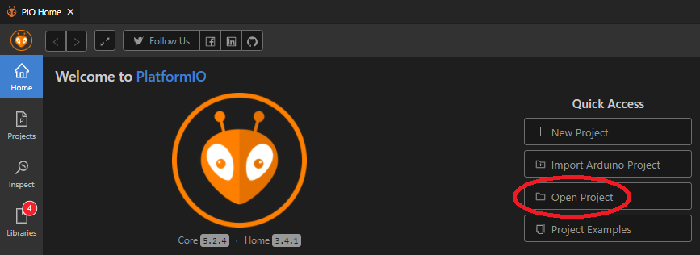
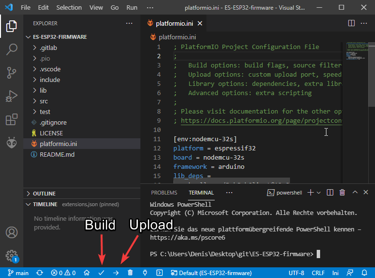

# **ESP32-firmware**

This is the esp-firmware repository of the [Pick-by-Light](https://github.com/PBL-Pick-By-Light/Pick_By_Light) project. Detailed information about the functionality and documentation can be found in the docs folder.

---
## **Description**

As we are trying to create our Pick-By-Light system, we need some way to control the LEDs in our shelves.  
Therefor, we are using microcontrollers running dedicated firmware.  
_The software run by these microcontrollers is to be found in this part of the project._  
They are responsible for reacting to messages using the [MQTT-Protocol](https://mqtt.org/) and fulfill send assignments.
These include:
* Controlling any connected LEDs
* Using the microcontrollers memory to save its own shelf-configuration, and
* have the ability to load a backup back into the main database in case of a critical failure  
  
For achieving these abilities, the firmware takes care of basic functionality, like:
* Connecting to a WLAN
* Setting up a MQTT Client, 
* Register the shelf in a system with (possibly) mutliple shelves, and thereafter
* Listen to any incoming messages

In conclusion, the firmware acts as heart & soul of the used shelves, for awesome behavior like this:  
  

  
The current software is made to work with an [ESP32](https://www.espressif.com/en/products/socs/esp32) by [espressif](https://www.espressif.com/en).

---
## **Getting Started**

### **Dependencies**
We recommend to use Visual Studio Code as an IDE to make using PlatformIO more comfortable.

* [VSC Plugin: PlatformIO IDE](https://platformio.org/platformio-ide)
* [Visual Studio Code](https://code.visualstudio.com/)
* [USB-Driver for ESP](https://www.silabs.com/developers/usb-to-uart-bridge-vcp-drivers) (Only needed under Windows)

If you want to use your own IDE, check out [CLI](https://docs.platformio.org/en/latest//core/index.html).

### **Cloning**

```bash
git clone https://github.com/PBL-Pick-By-Light/ES-ESP32-firmware.git
```

### **Configuration**

* Change these values to fit to your environment in ES-ESP32-firmware/src/main.cpp
```cpp
line20: const char* ssid = "<WLAN-SSID>"; // e.g. "PBL-WIFI-77"
line21: const char* password = "<WLAN-PASSWORD>"; // e.g. "Secret77Password11"
line25: const char* mqtt_server = "<MQTT-SERVER-IP>"; // e.g. "192.168.11.33"
line27: uint16_t mqtt_port = <port>; // e.g. 1883
```

### **Uploading onto ESP32**

* Load the folder "Firmware" in Visual Studio Code


* Connect the ESP32 with USB
* Use "PlatformIO: Upload"



### **Testing**

* Use "PlatformIO: New Terminal"
* Connect ESP32
* Paste into the terminal:
```bash
pio test
```
**Tests:**
1. `test_led_builtin_pin_number`
    - *Test if on connected ESP32 pin2 is a LED*
2. `test_led_state_high`
    - *Test if LED on pin2 can be turned on*
3. `test_led_state_low`
    - *Test if LED on pin2 can be turned off*
4. `test_get_mac`
    - *Test if the ESP32 responds a mac-address with the correct length*
5. `test_create_topic`
    - *Test if the function createTopic returns the expected order*

---
## **Troubleshooting**

* If your having problems with python while building, delete the related folder.
* If the connecting bar is stuck while uploading, hold the reset button on the esp until platformio connects.

## License

[Apache License 2.0](https://www.tldrlegal.com/l/apache2)