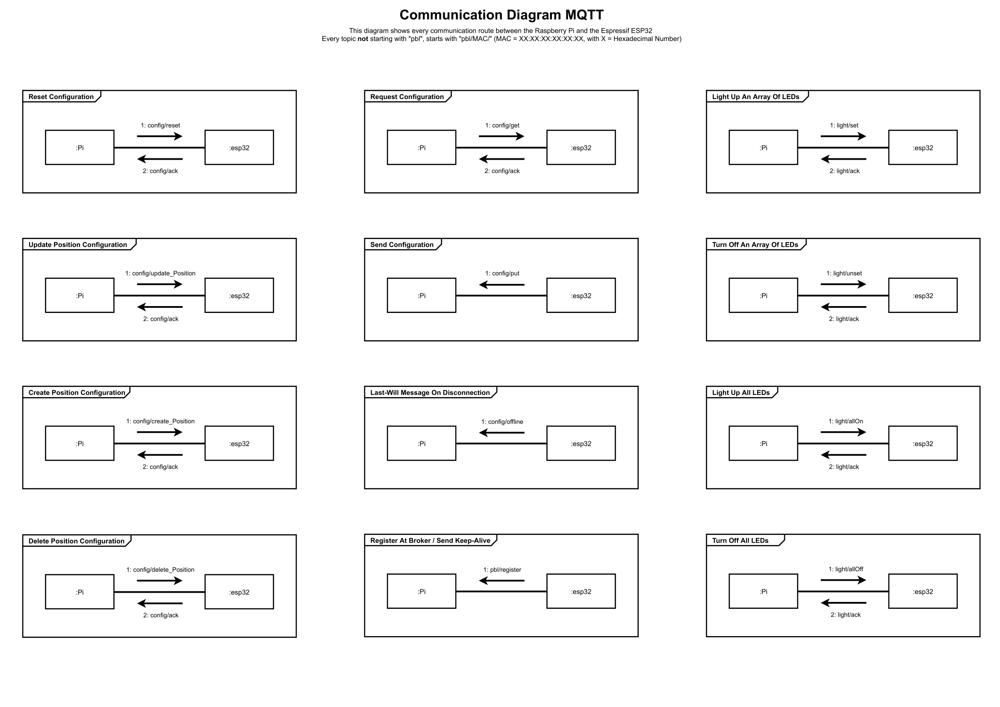

<!--- Use the plugins "PlantUML" by jebbs, "Markdown" PDF by yzane and "vscode-pdf" by tomoki1207 with vscode to see the plantuml -->

# Documentation and Diagrams

---

@startuml
skinparam ComponentBorderColor transparent
skinparam Shadowing false

skinparam usecase {
BackgroundColor limegreen
BorderColor black
}

skinparam usecaseFontColor black
skinparam usecaseFontSize 15
skinparam usecaseFontName Aapex

skinparam ComponentFontSize 25

component "MQTT-Topics" {
    usecase (pbl/) #white
    usecase (register) #OrangeRed
    usecase (MAC/) #white
    usecase (config/) #white
    usecase (reset)
    usecase (update_Position)
    usecase (create_Position)
    usecase (delete_Position)
    usecase (get)
    usecase (offline) #OrangeRed
    usecase (put) #OrangeRed
    usecase (ack) as ack1 #OrangeRed
    usecase (light/) #white
    usecase (allOff)
    usecase (allOn)
    usecase (set)
    usecase (unset)
    usecase (ack) as ack2 #OrangeRed

    left to right direction
    (pbl/) --> (register)
    (pbl/) --> (MAC/)

    (MAC/) --> (config/)
    (config/) --> (reset)
    (config/) --> (update_Position)
    (config/) --> (create_Position)
    (config/) --> (delete_Position)
    (config/) --> (get)
    (config/) --> (offline)
    (config/) --> (put)
    (config/) --> ack1

    (MAC/) --> (light/)
    (light/) --> allOff
    (light/) --> allOn
    (light/) --> (set)
    (light/) --> (unset)
    (light/) --> ack2

  file "Legend:" {
    usecase " " #OrangeRed
    usecase "  " #limegreen

    note bottom of ( ) : Esp publishes / Pi listens
    note bottom of (  ) : Pi publishes / Esp listens
  }
}

legend bottom
  | |= Technische Hochschule Mittelhessen – THM \n University of Applied Sciences |
  | Repository | [[https://git.thm.de/softwaretechnik-projekt-pick-by-light-system-wise21_22/pbl-embedded-system/wiki/]] |
  | UML-Tool| PlantUML v1.2022.0|
  | Model version| 1.0 |
  | Creation date| 09.12.2021 |
  | Creator| Joel Silas Zelenak and David Lotz |
  | Mail | joel.zelenak@mni.thm.de |
  | Last change| 25.01.2022 |
end legend
@enduml

 
 
 
 
 

Topics | Payload | Description
-------- | -------- | --------
.../config/reset   | [ Byte AckID ]   | Reset the LED configuration on esp32 (clear its permanent memory)
.../config/update_Position   | [ Byte AckID, Byte Position, Byte LED1, Byte LED2, Byte LED3, ... ]   | Update the LED configuration of a position
.../config/create_Position   | [ Byte AckID, Byte Position, Byte LED1, Byte LED2, Byte LED3, ... ]   | Create a LED configuration of a position
.../config/delete_Position   | [ Byte AckID, Byte Position ]   | Delete the LED configuration of a position
.../config/get   |  [ Byte AckID ]  | Tell the esp32 to send its current configuration
.../config/put   |  [ Byte PositionID, Byte LED1, Byte LED2, ... ]  | Send current configuration.   PositionID is the ID of the position described in this message.   The esp32 publishes as many messages as there are configured positions.
.../config/ack   | [ Byte AckID ]   | Acknowledge a received and executed "config" message
.../config/offline   |  [ NULL ]  | LastWillTopic of every ESP32 where a null byte array is sent from the Broker when a disgraceful disconnection from an ESP32 is detected.
.../light/allOn   | [ Byte AckID, Byte R, Byte G, Byte B ]   | Turn on all LEDs
.../light/allOff   | [ Byte AckID ]   | Turn off all LEDs
.../light/set   | [ Byte AckID, Byte LED1, Byte LED2, ..., Byte R, Byte G, Byte B ]   | Turn on a specific array of LEDs
.../light/unset   | [ Byte AckID, Byte LED1, Byte LED2, ..., ]   | Turn off a specific array of LEDs
.../light/ack   | [ Byte AckID ]   | Acknowledge a received and executed "light" message
pbl/register | [ 11x Byte Mac ] | Register a ESP32 on the Pi with its MAC address. ESP32 sends periodically his MAC address as keep-alive message.

---

---

## Using the WLAN & MQTT Module on esp32
Include the esp32_wlan.h and esp32_mqtt.h Header-Files before trying to use any functions. Moreover, these modules rely on the PubSubClient Library by Nick O`Leary, so this must be included in your project, too.
Sequence of correct function calls + explanation:

@startuml
skinparam note {
BackgroundColor white
BorderColor black
}

:bool connectWiFi(ssid,passwd);
floating note right: This function establishes a wireless LAN connection, using the WiFi.h library\nfrom Arduino. It tries to connect to the specified WLAN, using given ssid and\npassword.\nArguments "ssid" and "passwd" are\nboth of const char* type, and are preferably created as global variables in a "//WLAN connection settings"\nsection of the main.cpp file.\nIf the connection was a success, true is returned.
:bool setupMQTT(mqtt_server, mqtt_port);
floating note right: This function sets up the current MQTT settings, depositting the server address\nand wanted port for later connections in the client of the MQTT module.\nArgument "mqtt_server" is of const char* type, "mqtt_port" is of uint16_t type.\nThey are preferably created as global variables in a "//MQTT connection settings"\nsection of the main.cpp file.\nReturns true if settings were made successfully.
:bool setCallback(void ((*callback)(char* topic, byte* message, unsigned int length));
floating note right: This function is used to set the callback() function inside the MQTT-module.\nThe function itself shall be coded inside the main-file, to have all future changes,\nwhich adress behavior of the controller, inside the main file.\nIt's pointer must then be passed to the setCallback() function.
:bool reconnect(char* client_name);
floating note right: This function tries to connect to the Broker specified by calling the setupMQTT()\n function.\nArgument "client_name" is of char* type, and is preferably created as global\nvariable in a "//MQTT connection settings" section of the main.cpp file.\nReturns true if the connection was a success.
:bool subscribeTo(topic);
floating note right: This function is used to subscribe the client to a specified topic.\nArgument "topic" is of const char* type, and is preferably created as global\nvariable in a "//MQTT connection settings" section of the main.cpp file.\nIt is strongly recommended to use different topics for either publishing or\nlistening to messages, as a message published on a topic that is also listened to,\nresults in this client receiving its own message. Whether or not the client reacts\nto such a message must be specified in the callback() function inside the MQTT\nmodule.\nReturns true if the subscription was a success.
:listen();
floating note right: This function is used to listen to all topics that this client is subscribed to.\nWhen the client should be waiting for incoming messages, this must be called()\ncontinuously inside a while-loop.\nIf any message on any subscribed topic is received, the callback() function inside\nthe MQTT module is called and any code inside it is executed.

-[hidden]-> \n;
:bool publishMsg(topic, payload);
floating note right: This function is used to listen to publish a message on a specified topic.\nArguments "topic" and "payload" are of const char* type.\nReturns true if publishing the message was a success.
@enduml

---

## Using the (current) LED controls for a LED stripe
This module is designed to be used via Platform.io. Place this header file inside your src directory and use the implemented methods in your code. To use the LED.h header you need to make sure the Adafruit NeoPixel library and the Arduino.h are installed in your project.
Make sure the LED Stripe is connected to PIN 2 on your board.
This library works staticly with one connected LED stripe and you dont need to create any objects whatsoever.

@startuml
skinparam note {
BackgroundColor white
BorderColor black
}

:LEDInit();
floating note right: This method needs to be called in the the setup method of\nthe main to initialize all pixels on the LED stripe.

-[hidden]-> \n;

:LEDOffAll();
floating note right: This method turns off all pixels.
detach
:LightUpAll();
floating note right: Light up all LEDs with red, green and blue for a short amount of time.
detach
:LEDGlowNext();
floating note right: This method turns on the next LED in the row after the in\nthe previous method selected starting point. (LED Nr =\nstart+1)
detach
:LEDOff(start, end);
floating note right: The LEDoff method turns off all pixels between the starting\nand ending pixels (including the start and end pixel)
detach
:LEDGlowStart(start);
floating note right: This method turns on one selected start LED to help\nindicate position of marker whilst setting up the size of a\ncabinet.
detach
:LEDGlow(start, end, R, G, B);
floating note right:The LEDglow method expects a starting pixel, an ending\npixel and red, green and blue color values and turns on all\ncorresponding pixels in the chosen color.
detach
:AnimationSnake(rows, columns, rainbowMode);
floating note right: Displays a snake-like animation with all available LEDs.
@enduml